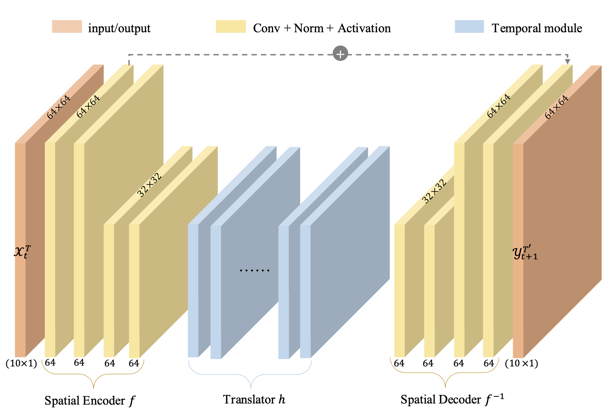
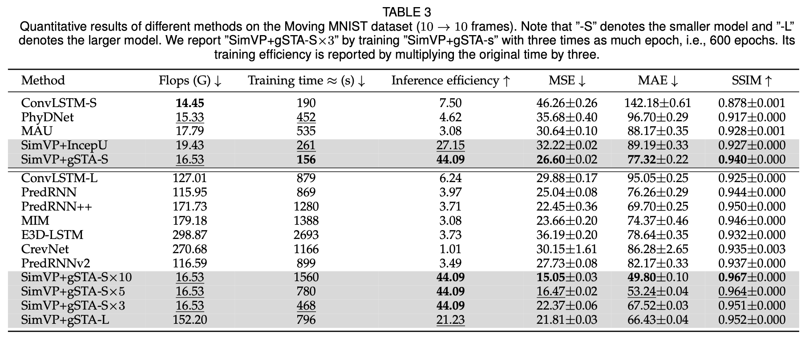

# SimVP: Towards Simple yet Powerful Spatiotemporal Predictive learning

This repository contains the implementation code for paper:

**SimVP: Towards Simple yet Powerful Spatiotemporal Predictive learning**  
[Cheng Tan](https://westlake-drug-discovery.github.io/cheng_tan.html), [Zhangyang Gao](https://westlake-drug-discovery.github.io/zhangyang_gao.html), [Stan Z. Li](https://scholar.google.com/citations?user=Y-nyLGIAAAAJ&hl).

## Introduction

This is the journal version of our previous conference work (SimVP: Simpler yet Better Video Prediction, In CVPR 2022).

The overall framework of SimVP.
<p align="center">
     <br>
</p>

The performance of SimVPs on the Moving MNIST dataset. For the training time, the less the better. For the inference efficiency (frames per second), the more the better.
<p align="center">
     <br>
</p>

Quantitative results of different methods on the Moving MNIST dataset ($10 \rightarrow 10$ frames).
<p align="center">
     <br>
</p>

## Dependencies
* argparse
* numpy
* hickle
* scikit-image=0.16.2
* torch
* timm
* tqdm

## Overview

* `api/` contains dataloaders and metrics.
* `methods/` contains training methods for various video prediction methods.
* `models/` contains the main network architectures of various video prediction methods.
* `modules/` contains network modules and layers.
* `main.py` is the executable python file with possible arguments for training, validating, and testing pipelines.

## Install

This project has provided an environment setting file of conda, users can easily reproduce the environment by the following commands:
```
  conda env create -f environment.yml
  conda activate SimVP
```

### Moving MNIST dataset

```
  cd ./data/moving_mnist
  bash download_mmnist.sh
```

## Citation

If you are interested in our repository and our paper, please cite the following paper:

```
@article{tan2022simvp,
  title={SimVP: Towards Simple yet Powerful Spatiotemporal Predictive Learning},
  author={Tan, Cheng and Gao, Zhangyang and Li, Stan Z},
  journal={arXiv preprint arXiv:2211.12509},
  year={2022}
}
```

## Contact

If you have any questions, feel free to contact us through email (tancheng@westlake.edu.cn). Enjoy!
